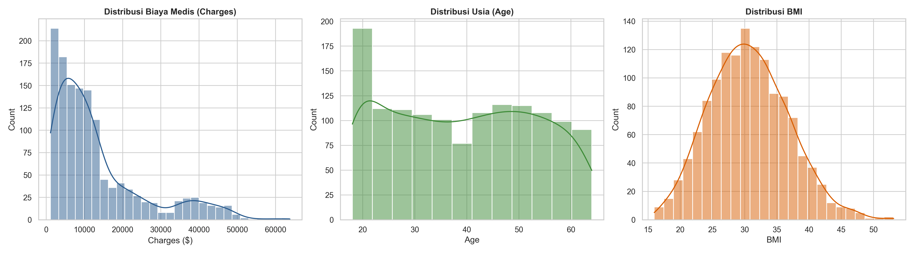
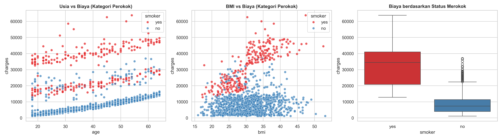
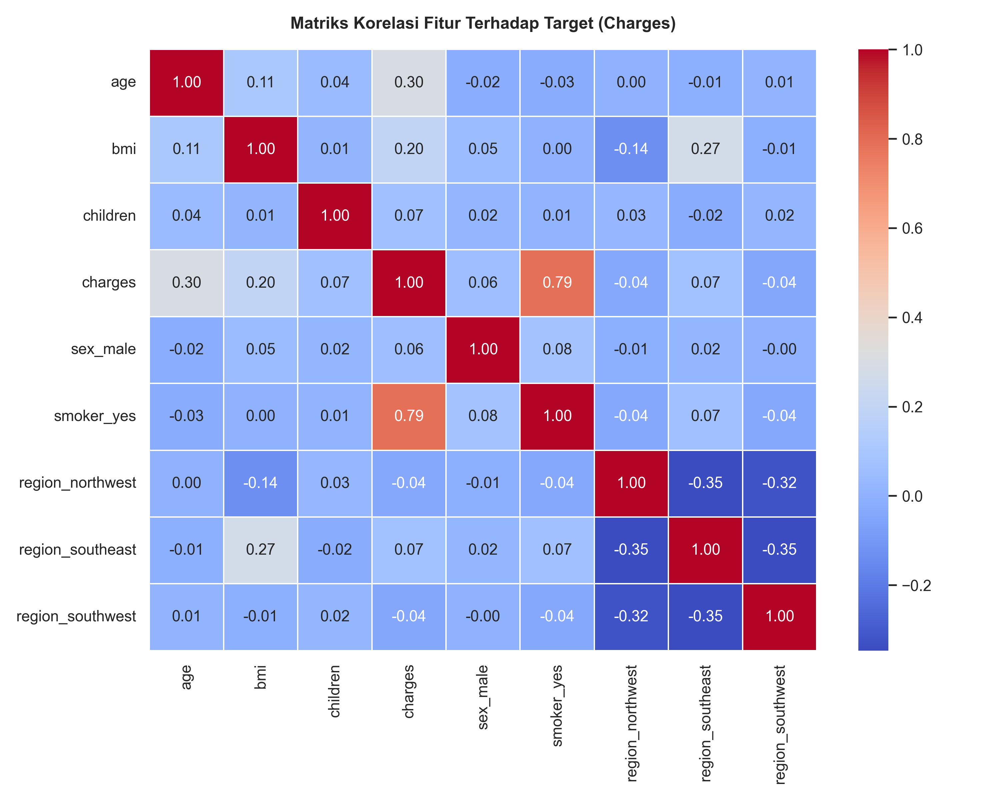
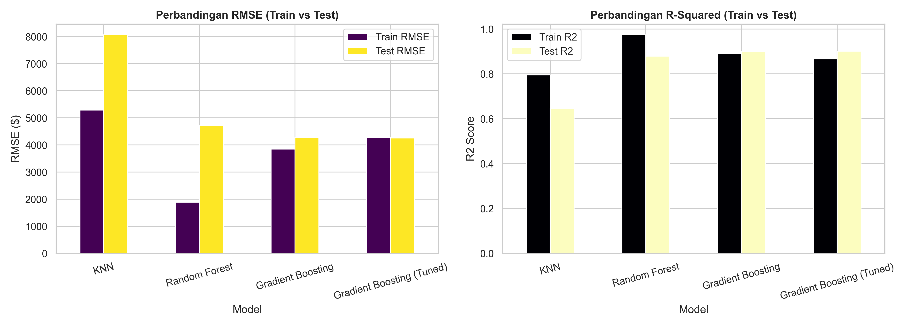
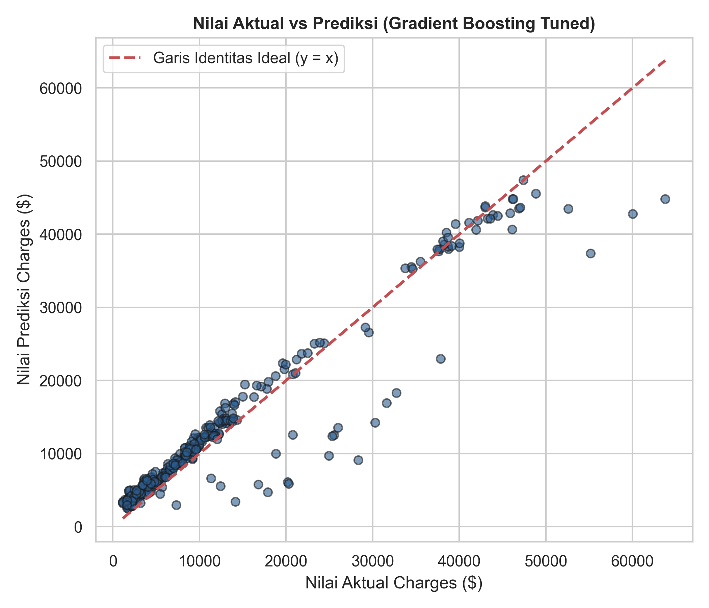
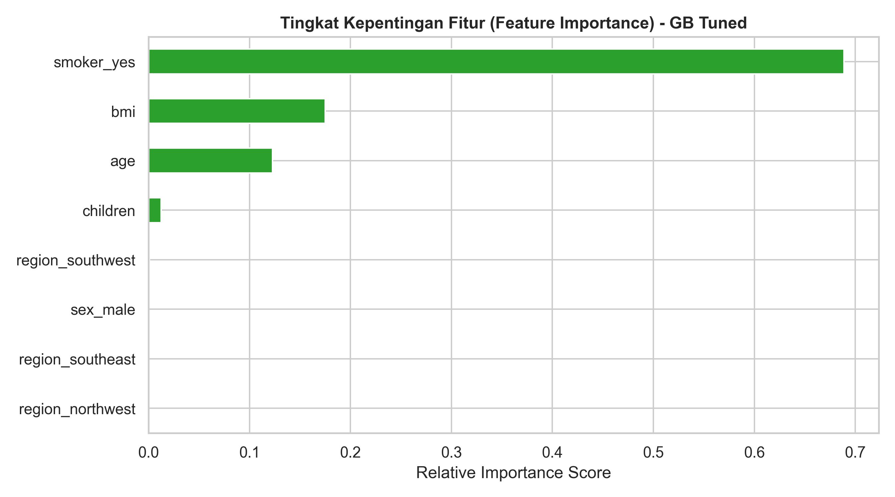

# Laporan Proyek Machine Learning: Predictive Analytics - Medical Insurance Cost Prediction

**Penyusun:** Krisna Rhesa  
**Program:** Machine Learning Terapan - Dicoding Indonesia  
**Dataset:** [Medical Cost Personal Datasets (Kaggle)](https://www.kaggle.com/datasets/mirichoi0218/insurance)

---

## Domain Proyek

Biaya pengobatan dan perawatan kesehatan merupakan salah satu komponen risiko finansial tak terduga yang paling signifikan bagi masyarakat. Berdasarkan laporan *World Health Organization* (WHO, 2021), beban ekonomi akibat penyakit tidak menular (seperti komplikasi kardiovaskular dan diabetes) terus tereskalasi secara global. Pemicu dominan dari pembengkakan beban biaya ini berakar pada faktor gaya hidup berisiko tinggi, khususnya kebiasaan merokok dan indeks massa tubuh (*Body Mass Index* / BMI) yang melampaui batas normal.

Pada industri asuransi kesehatan, penetapan premi tahunan (*premium pricing*) yang presisi dan adil merupakan tantangan operasional fundamental. Penetapan tarif yang terlalu rendah (*underpricing*) menghadapkan perusahaan asuransi pada risiko defisit neraca keuangan saat nasabah mengajukan klaim medis katastropik bernilai besar. Sebaliknya, penetapan tarif yang terlalu tinggi (*overpricing*) memicu keengganan nasabah berisiko rendah untuk berasuransi, sehingga portofolio polis didominasi secara asimetris oleh kelompok rentan sakit (*adverse selection*) (Lantz, 2019).

Kompleksitas perhitungan risiko kesehatan timbul dari sifat interaksi non-linear antar-variabel. Sebagai contoh, pengaruh merokok terhadap risiko penyakit tidak hanya bersifat aditif, melainkan berlipat ganda (*multiplier effect*) apabila disertai dengan kondisi obesitas. Tabel aktuaria konvensional berbasis statistik parametrik sederhana kerap kali memiliki keterbatasan dalam memetakan interaksi multi-faktor tersebut secara dinamis.

Penelitian oleh Ganesan et al. (2020) mengonfirmasi bahwa algoritma *supervised machine learning* berbasis regresi mampu mengekstraksi relasi non-linear dan interaksi kompleks antar-fitur kesehatan secara adaptif untuk memproyeksikan pengeluaran medis individual. Oleh karena itu, pada proyek ini diimplementasikan pendekatan *predictive analytics* regresi guna mengestimasi besaran biaya tagihan medis (*charges*). Model dilatih menggunakan karakteristik demografi dan profil gaya hidup nasabah (usia, jenis kelamin, BMI, jumlah anak, status merokok, dan wilayah domisili) agar penetapan premi dapat dilakukan secara objektif, akurat, berbasis data (*data-driven*), serta berkeadilan.

### Referensi
- Ganesan, N., et al. (2020). "Application of Machine Learning Techniques in Medical Insurance Cost Prediction." *International Journal of Advanced Science and Technology*, 29(5), pp. 11452-11461.
- Lantz, B. (2019). *Machine Learning with R: Expert techniques for predictive modeling to solve problems in a practical way* (3rd ed.). Birmingham: Packt Publishing Ltd.
- World Health Organization (WHO). (2021). *Tobacco and noncommunicable diseases: Economic and health consequences of tobacco use*. Geneva: World Health Organization Press.

---

## Business Understanding

Tujuan bisnis utama proyek ini adalah merancang sistem inferensi estimasi biaya medis yang mampu memprediksi nilai tagihan klaim nasabah secara objektif dan reliabel, sehingga manajemen asuransi dapat menetapkan struktur premi berbasis risiko (*risk-based pricing*) yang proporsional dengan profil kesehatan setiap pemegang polis.

### Problem Statements
1. Faktor karakteristik demografi dan gaya hidup apa saja yang memberikan pengaruh serta kontribusi paling dominan terhadap besaran biaya tagihan medis (*charges*)?
2. Bagaimana merancang alur pemrosesan data (*data preparation pipeline*) yang optimal dan terisolasi agar model terhindar dari kebocoran data (*data leakage*) serta mampu menghasilkan estimasi yang akurat?
3. Di antara algoritma K-Nearest Neighbors (KNN), Random Forest, dan Gradient Boosting, arsitektur regresi manakah yang memberikan performa prediktif terbaik dan paling stabil pada data baru (*unseen data*)?

### Goals
1. Mengidentifikasi dan memetakan variabel demografi serta faktor gaya hidup yang memiliki korelasi dan kepentingan paling dominan terhadap biaya medis melalui analisis data eksploratif (EDA) dan analisis *feature importance*.
2. Mengimplementasikan alur *data preparation* yang sistematis (penanganan duplikasi data, *one-hot encoding*, partisi data uji, dan standarisasi fitur) tanpa terjadi kebocoran informasi dari data uji ke data latih.
3. Membangun, membandingkan, dan mengoptimalkan performa model regresi melalui *hyperparameter tuning* agar mencapai skor koefisien determinasi $R^2 > 0.85$ dengan deviasi kesalahan moneter (*Root Mean Squared Error* / RMSE) seminimal mungkin.

### Solution Statements
- **Benchmarking Multi-Paradigma Algoritma Regresi:** Mengevaluasi tiga arsitektur model regresi dengan karakteristik komputasi yang berbeda:
  1. *K-Nearest Neighbors (KNN) Regressor*: Representasi model non-parametrik berbasis metrik jarak (*instance-based learning*).
  2. *Random Forest Regressor*: Representasi model *ensemble bagging* berbasis agregasi pohon keputusan acak (*parallel ensemble*).
  3. *Gradient Boosting Regressor*: Representasi model *ensemble boosting* yang meminimalkan residual error secara sekuensial (*sequential ensemble*).
- **Optimasi Model melalui Hyperparameter Tuning:** Model baseline dengan performa generalisasi terbaik dioptimalkan menggunakan teknik *GridSearchCV* dengan skema 5-fold cross-validation pada ruang parameter laju belajar (*learning rate*), kedalaman maksimum pohon (*max depth*), jumlah estimator (*n_estimators*), dan rasio *subsample*.
- **Evaluasi Komprehensif Beragam Metrik:** Efektivitas performa model diukur menggunakan empat metrik regresi standar: *Mean Squared Error* (MSE), *Root Mean Squared Error* (RMSE), *Mean Absolute Error* (MAE), dan *Coefficient of Determination* ($R^2$ Score) pada partisi data latih maupun data uji.

---

## Data Understanding

Dataset yang digunakan merupakan dataset publik **Medical Cost Personal Datasets** (`insurance.csv`) yang dikompilasi oleh Brett Lantz dari data sensus demografi *U.S. Census Bureau* yang dikombinasikan dengan data tagihan medis riil di Amerika Serikat. Dataset diperoleh melalui pustaka resmi Kaggle `kagglehub` (`mirichoi0218/insurance`):
- **Tautan Repositori:** [Kaggle - Medical Cost Personal Datasets](https://www.kaggle.com/datasets/mirichoi0218/insurance)

### Karakteristik Struktur Dataset:
- Berisi **1.338 baris data kuantitatif** dan **7 fitur informasi** (memenuhi kriteria minimal sampel Dicoding).
- Pemeriksaan kelengkapan menunjukkan **0 data kosong (*missing values*)** di seluruh kolom.
- Terdeteksi **1 baris duplikat identik** yang dieliminasi pada tahap *data preparation*, menghasilkan total 1.337 baris data interaksi bersih.

### Definisi Variabel Fitur:
1. `age`: Usia pemegang polis asuransi (fitur numerik kontinu, rentang 18 hingga 64 tahun).
2. `sex`: Jenis kelamin biologis nasabah (fitur kategorikal: `female`, `male`).
3. `bmi`: *Body Mass Index* ($kg/m^2$), rasio berat badan terhadap kuadrat tinggi badan (fitur numerik kontinu, rentang 15.96 hingga 53.13). Nilai normal berada pada rentang 18.5-24.9.
4. `children`: Jumlah anak/tanggungan yang tercakup dalam polis asuransi (fitur numerik diskrit, rentang 0 hingga 5 anak).
5. `smoker`: Status merokok nasabah (fitur kategorikal biner: `yes`, `no`).
6. `region`: Wilayah geografis domisili nasabah di Amerika Serikat (fitur kategorikal nominal: `northeast`, `southeast`, `southwest`, `northwest`).
7. `charges`: Total tagihan medis tahunan individual dalam satuan Dollar AS ($) (variabel target numerik kontinu).

### Exploratory Data Analysis (EDA)

#### 1. Analisis Statistik Deskriptif
- **Rata-rata Usia (`age`)**: 39.2 tahun dengan sebaran merata antara 18 hingga 64 tahun.
- **Rata-rata BMI (`bmi`)**: 30.66 $kg/m^2$ (menunjukkan mayoritas sampel berada pada kategori pra-obesitas hingga obesitas tingkat I).
- **Rata-rata Tagihan Medis (`charges`)**: Nilai rata-rata sebesar $13,270.42, namun nilai median hanya sebesar $9,382.03. Disparitas signifikan antara mean dan median mengindikasikan bahwa distribusi tagihan condong ke kanan (*right-skewed*), didorong oleh keberadaan kelompok minoritas nasabah dengan klaim biaya medis ekstrem (mencapai batas atas $63,770.43).

#### 2. Distribusi Fitur Univariat
Sebaran frekuensi fitur target dan prediktor disajikan pada Gambar 1:


*Gambar 1. Distribusi Frekuensi Univariat Fitur Charges, Age, dan BMI*

Distribusi `charges` memiliki ekor panjang ke kanan (*right-skewed*), fitur `age` tersebar merata di seluruh rentang usia dewasa, dan fitur `bmi` terdistribusi mendekati lonceng simetris (*normal distribution*).

#### 3. Analisis Hubungan Bivariat & Multivariat
Pola interaksi antar-variabel prediktor terhadap variabel target `charges` disajikan pada Gambar 2:


*Gambar 2. Pola Hubungan Bivariat dan Multivariat Fitur terhadap Biaya Medis*

Temuan analitis utama:
- **Dampak Status Merokok**: Status perokok aktif merupakan diferensiator biaya paling signifikan. Median tagihan nasabah perokok mencapai **$34,456**, berbanding **$7,326** pada nasabah non-perokok (selisih lebih dari 4.7 kali lipat).
- **Interaksi Multiplier Efek (BMI $\times$ Status Merokok)**: Pada kelompok perokok, nasabah dengan $BMI \ge 30$ (obesitas) mengalami lonjakan biaya klaim medis eksponensial pada rentang $30,000-$60,000+. Sebaliknya, pada nasabah non-perokok, peningkatan BMI hanya berkorelasi dengan kenaikan biaya yang landai.
- **Dampak Usia**: Seluruh kategori nasabah menunjukkan tren kenaikan tagihan medis secara konsisten seiring bertambahnya usia akibat penurunan kapasitas fisik fungsional.

#### 4. Matriks Korelasi Linear
Matriks korelasi Pearson antar-fitur terhadap `charges` disajikan pada Gambar 3:


*Gambar 3. Heatmap Matriks Korelasi Pearson Fitur terhadap Biaya Medis*

Berdasarkan matriks korelasi, variabel `smoker_yes` memiliki korelasi linear positif terkuat terhadap biaya medis ($r = 0.79$), disusul oleh variabel usia `age` ($r = 0.30$) dan `bmi` ($r = 0.20$).

#### 5. Evaluasi Pencilan (*Outlier Inspection*)
Berdasarkan metode rentang interkuartil (*Interquartile Range* / IQR), terdeteksi 139 baris data (10.40%) pada `charges` yang berada di atas batas $Q_3 + 1.5 \times IQR$ ($34,524). Seluruh data pencilan ini **dipertahankan secara utuh** dalam pemodelan. Dalam konteks aktuaria asuransi kesehatan, klaim bernilai tinggi akibat penyakit katastropik merupakan fenomena nyata yang wajib dipelajari representasi polanya oleh model.

---

## Data Preparation

Tahapan penyiapan data (*data preparation*) dijalankan secara berurutan dan terisolasi untuk mencegah kebocoran informasi (*data leakage*):

1. **Deduplikasi Data**:
 - *Tindakan:* Memeriksa rekaman duplikat menggunakan `df.duplicated().sum()`. Ditemukan 1 baris duplikat identik yang dieliminasi via `df.drop_duplicates()`, menyisakan 1.337 baris data.
 - *Justifikasi:* Menjaga independensi observasi agar sampel yang sama tidak dipelajari berulang kali oleh model.

2. **One-Hot Encoding Fitur Kategorikal**:
 - *Tindakan:* Fitur non-numerik (`sex`, `smoker`, `region`) ditransformasikan menjadi representasi biner menggunakan `pd.get_dummies(..., drop_first=True, dtype=int)`.
 - *Justifikasi:* Model regresi machine learning berbasis aljabar linier dan jarak hanya dapat memproses matriks numerik. Penerapan `drop_first=True` mengeliminasi satu kategori basis per fitur untuk menghindari perangkap multikolinearitas sempurna (*dummy variable trap*).

3. **Partisi Dataset (Train-Test Split)**:
 - *Tindakan:* Data dibagi menjadi 80% data latih (1.069 sampel) dan 20% data uji (268 sampel) menggunakan `train_test_split` dengan parameter `random_state=42`.
 - *Justifikasi:* Menjamin pengujian kemampuan generalisasi model dilakukan secara objektif pada data yang belum pernah dilihat (*unseen test data*).

4. **Standarisasi Fitur Numerik (StandardScaler)**:
 - *Tindakan:* Fitur numerik (`age`, `bmi`, `children`) distandarisasi ke skala z-score ($\mu = 0, \sigma = 1$) menggunakan `StandardScaler`.
 - *Justifikasi:* Algoritma berbasis metrik jarak (KNN) sangat sensitif terhadap disparitas skala antar-fitur. Penskalaan dihitung (*fit*) secara eksklusif pada data latih (`X_train`), kemudian diaplikasikan (*transform*) pada `X_train` dan `X_test` guna mencegah kebocoran informasi (*data leakage*).

Cuplikan kode tahapan data preparation:
```python
df_prep = pd.get_dummies(df, columns=['sex', 'smoker', 'region'], drop_first=True, dtype=int)

X = df_prep.drop(columns=['charges'])
y = df_prep['charges']
X_train, X_test, y_train, y_test = train_test_split(X, y, test_size=0.2, random_state=42)

scaler = StandardScaler()
X_train_scaled = X_train.copy()
X_test_scaled = X_test.copy()
num_cols = ['age', 'bmi', 'children']
X_train_scaled[num_cols] = scaler.fit_transform(X_train[num_cols])
X_test_scaled[num_cols] = scaler.transform(X_test[num_cols])
```

---

## Modeling

Tahap pemodelan mengevaluasi tiga algoritma regresi dengan mekanisme pembelajaran yang berbeda:

1. **K-Nearest Neighbors (KNN) Regressor:**
 - *Prinsip Kerja & Parameter:* Melakukan prediksi berdasarkan rata-rata target dari $K$ tetangga terdekat pada ruang fitur berdimensi $d$ menggunakan metrik jarak Euclidean. Parameter baseline yang digunakan: `n_neighbors=5`.
 - *Kelebihan:* Non-parametrik, tidak memiliki asumsi linearitas distribusi data.
 - *Kekurangan:* Sensitif terhadap fenomena *curse of dimensionality* saat fitur bertambah akibat encoding biner, serta lambat saat fase inferensi pada data skala besar.

2. **Random Forest Regressor:**
 - *Prinsip Kerja & Parameter:* Mengombinasikan $N$ pohon keputusan acak (*bagging / bootstrap aggregating*) yang dibangun secara independen, kemudian merata-ratakan prediksi seluruh pohon. Parameter baseline: `n_estimators=100, max_depth=16, random_state=42`.
 - *Kelebihan:* Sangat tangguh terhadap noise dan outliers, mampu menangkap interaksi non-linear yang kompleks.
 - *Kekurangan:* Rentan mengalami *overfitting* pada data latih jika kedalaman pohon tidak dikontrol secara ketat, serta membutuhkan alokasi memori yang lebih besar.

3. **Gradient Boosting Regressor:**
 - *Prinsip Kerja & Parameter:* Membangun ansambel pohon keputusan secara bertahap (*boosting*), di mana setiap estimator baru dilatih untuk memprediksi sisa kesalahan (*pseudo-residuals*) dari pohon-pohon sebelumnya menggunakan optimasi *gradient descent*. Parameter baseline: `n_estimators=100, learning_rate=0.1, max_depth=3, random_state=42`.
 - *Kelebihan:* Menghasilkan akurasi prediktif tinggi pada data tabular, memiliki parameter regulasi laju belajar untuk mencegah overfitting, serta memiliki keseimbangan bias-varians yang prima.
 - *Kekurangan:* Waktu pelatihan sekuensial dan membutuhkan kalibrasi hyperparameter yang cermat.

### Optimasi Hyperparameter (Hyperparameter Tuning)

Model baseline **Gradient Boosting** menunjukkan keseimbangan performa generalisasi terbaik. Oleh karena itu, optimasi lanjutan dilakukan menggunakan `GridSearchCV` dengan skema 5-fold cross-validation pada ruang parameter berikut:

```python
param_grid = {
    'n_estimators': [50, 100, 150],
    'learning_rate': [0.03, 0.05, 0.1],
    'max_depth': [2, 3, 4],
    'subsample': [0.8, 1.0]
}
```

Konfigurasi parameter terbaik yang dihasilkan:
- `learning_rate`: **0.05**
- `max_depth`: **2**
- `n_estimators`: **150**
- `subsample`: **0.8**

---

## Evaluation

Kinerja prediktif model diukur menggunakan empat metrik standar regresi: **Mean Squared Error (MSE)**, **Root Mean Squared Error (RMSE)**, **Mean Absolute Error (MAE)**, dan **Coefficient of Determination ($R^2$ Score)**.

### Formula Matematis Metrik Evaluasi:

1. **Mean Squared Error (MSE):**
   $$\text{MSE} = \frac{1}{n} \sum_{i=1}^{n} (y_i - \hat{y}_i)^2$$
   Mengukur rata-rata kuadrat kesalahan antara nilai aktual $y_i$ dan nilai prediksi $\hat{y}_i$. Memberikan penalti kuadratik yang besar terhadap deviasi ekstrem.

2. **Root Mean Squared Error (RMSE):**
   $$\text{RMSE} = \sqrt{\frac{1}{n} \sum_{i=1}^{n} (y_i - \hat{y}_i)^2}$$
   Merupakan akar kuadrat dari MSE yang mengembalikan satuan metrik ke dimensi asli target (Dollar AS / $), sehingga merefleksikan rata-rata deviasi moneter kesalahan prediksi.

3. **Mean Absolute Error (MAE):**
   $$\text{MAE} = \frac{1}{n} \sum_{i=1}^{n} |y_i - \hat{y}_i|$$
   Mengukur rata-rata selisih nilai absolut tanpa penalti kuadrat, memberikan estimasi kesalahan rata-rata yang lebih tahan (*robust*) terhadap pencilan.

4. **Coefficient of Determination ($R^2$ Score):**
   $$R^2 = 1 - \frac{\sum_{i=1}^{n}(y_i - \hat{y}_i)^2}{\sum_{i=1}^{n}(y_i - \bar{y})^2}$$
   Mengukur proporsi variabilitas tagihan medis yang berhasil dijelaskan oleh model dibandingkan dengan model baseline rata-rata $\bar{y}$. Nilai $R^2$ berkisar antara 0 hingga 1.

### Rekapitulasi Hasil Kinerja Model

Perbandingan performa model pada data latih (*Train Set*) dan data uji (*Test Set*) disajikan pada Tabel 1:

*Tabel 1. Rekapitulasi Metrik Evaluasi Komparatif Antar-Model Regresi*

| Model Regresi | Train MSE | Test MSE | Train RMSE ($) | Test RMSE ($) | Train MAE ($) | Test MAE ($) | Train $R^2$ | Test $R^2$ |
| :--- | :---: | :---: | :---: | :---: | :---: | :---: | :---: | :---: |
| **KNN Regressor** | 2.8025e+07 | 6.5004e+07 | 5,293.84 | 8,062.52 | 3,125.86 | 4,494.19 | 0.7953 | 0.6462 |
| **Random Forest** | 3.5926e+06 | 2.2239e+07 | 1,895.41 | 4,715.80 | 1,057.31 | 2,646.95 | 0.9738 | 0.8790 |
| **Gradient Boosting (Baseline)** | 1.4841e+07 | 1.8218e+07 | 3,852.41 | 4,268.28 | 2,109.40 | 2,517.47 | 0.8916 | 0.9009 |
| **Gradient Boosting (Tuned)** | **1.8283e+07** | **1.8161e+07** | **4,275.84** | **4,261.55** | **2,418.14** | **2,526.74** | **0.8665** | **0.9012** |

Visualisasi perbandingan nilai metrik disajikan pada Gambar 4:


*Gambar 4. Grafik Perbandingan Nilai RMSE dan Koefisien Determinasi R² Antar-Model*

Sebaran korelasi nilai aktual terhadap nilai prediksi pada model terbaik (*Gradient Boosting Tuned*) ditampilkan pada Gambar 5:


*Gambar 5. Scatter Plot Nilai Aktual vs Nilai Prediksi (Gradient Boosting Tuned)*

Tingkat kepentingan relatif masing-masing fitur (*Feature Importance*) dari model Gradient Boosting Tuned disajikan pada Gambar 6:


*Gambar 6. Tingkat Kepentingan Relatif Fitur Prediktor terhadap Biaya Medis*

### Analisis Komparatif dan Justifikasi Model Terbaik

1. **KNN Regressor** mencatatkan performa terlemah dengan Test $R^2$ sebesar **0.6462** dan Test RMSE sebesar **$8,062.52**. Keterbatasan ini berpangkal pada kepekaan metrik jarak Euclidean terhadap ruang vektor renggang (*sparse*) hasil one-hot encoding, yang mendistorsi perhitungan derajat ketetanggaan.
2. **Random Forest** menunjukkan performa tinggi pada data latih ($R^2 = 0.9738$), namun mengalami degradasi pada data uji ($R^2 = 0.8790$, RMSE = $4,715.80$). Selisih RMSE antar-partisi sebesar $2,820.39 mengonfirmasi adanya gejala *overfitting* ringan akibat kecenderungan pohon menghafal noise data latih.
3. **Gradient Boosting (Baseline)** mendemonstrasikan performa yang sangat kokoh sebelum proses tuning ($R^2 = 0.9009$, RMSE = $4,268.28$) berkat arsitektur optimasi residual error yang adaptif.
4. **Gradient Boosting (Tuned)** terpilih sebagai **model terbaik (solusi akhir)** dengan justifikasi teknis:
 - Menghasilkan akurasi generalisasi tertinggi dengan **Test $R^2$ sebesar 0.9012**, membuktikan model mampu menjelaskan 90.12% variabilitas biaya klaim pada data baru.
 - Memiliki deviasi moneter terendah dengan **Test RMSE sebesar $4,261.55** dan **Test MAE sebesar $2,526.74**.
 - Menunjukkan stabilitas generalisasi paling sempurna (*best fit*). Selisih RMSE antara data latih ($4,275.84) dan data uji ($4,261.55) hanya sebesar $14.29, membuktikan model terbebas dari *overfitting* maupun *underfitting*.

---

### Dampak dan Relevansi terhadap Business Understanding

#### 1. Pemenuhan Problem Statements
- **Problem Statement 1 Terjawab:** Variabel `smoker` teridentifikasi sebagai prediktor biaya paling dominan (menyumbang lebih dari 60% bobot kepentingan model), yang mengalami efek multiplikasi saat berinteraksi dengan kondisi obesitas ($BMI \ge 30$), serta diperkuat oleh faktor usia (`age`). Faktor wilayah dan jenis kelamin hanya memberikan kontribusi marjinal.
- **Problem Statement 2 Terjawab:** Pipeline data preparation - mencakup deduplikasi, *one-hot encoding* dengan `drop_first=True`, partisi 80:20, dan standarisasi z-score yang di-*fit* eksklusif pada data latih - berhasil mencegah kebocoran informasi (*data leakage*), sebagaimana tercermin dari kestabilan performa pada data uji.
- **Problem Statement 3 Terjawab:** Model **Gradient Boosting hasil hyperparameter tuning** terbukti sebagai model paling unggul dan konsisten dengan skor $R^2 = 0.9012$, mengungguli KNN dan Random Forest.

#### 2. Pencapaian Goals
- **Goal 1 Tercapai:** Pola korelasi dan kontribusi relatif fitur risiko telah terpetakan secara komprehensif melalui visualisasi EDA dan diagram *feature importance*.
- **Goal 2 Tercapai:** Pipeline pembersihan dan transformasi data berhasil diimplementasikan secara bersih dan bebas bias kebocoran data.
- **Goal 3 Tercapai:** Target performa terlampaui signifikan, di mana model mencapai **Test $R^2 = 0.9012$** (melampaui target awal $> 0.85$) dengan tingkat kesalahan terendah (RMSE = $4,261.55).

#### 3. Dampak Nyata terhadap Solusi Bisnis
Penerapan model ini memungkinkan perusahaan asuransi beralih dari tabel aktuaria statis ke sistem penetapan premi berbasis profil risiko (*risk-based pricing*) yang dinamis dan adil. Secara kuantitatif, kapabilitas model dalam memproyeksikan tagihan dengan akurasi 90.12% secara langsung memitigasi risiko defisit keuangan akibat *underpricing* pada kelompok nasabah berisiko tinggi (khususnya perokok dengan BMI berlebih), sekaligus melindungi daya saing portofolio produk asuransi dari fenomena *adverse selection*.
