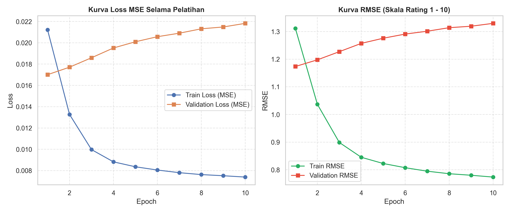

# Applied Machine Learning Projects

[](https://www.python.org/)
[](https://pytorch.org/)
[](https://scikit-learn.org/)
[](https://pandas.pydata.org/)
[](https://www.dicoding.com/academies/319)
[](LICENSE)

This repository contains production-grade machine learning projects developed as part of the **Applied Machine Learning** specialization at Dicoding Indonesia. It showcases end-to-end data science workflows - from business understanding, rigorous exploratory data analysis (EDA), and data isolation pipelines, to multi-paradigm modeling, hyperparameter optimization, and quantitative metric benchmarking.

---

## Executive Project Overview

| Project | Directory | Domain & Problem | Source Dataset | Key Algorithms | Primary Metrics | Test Set Performance |
| :--- | :--- | :--- | :--- | :--- | :--- | :---: |
| **01. Predictive Analytics** | [`01-predictive-analytics/`](01-predictive-analytics/) | *Healthcare & Actuarial Risk* | [Medical Cost Personal Datasets](https://www.kaggle.com/datasets/mirichoi0218/insurance) | KNN, Random Forest, **Tuned Gradient Boosting** | $R^2$ Score, RMSE, MAE | **$R^2 = 0.9012$**<br>RMSE = **$4,261.55** |
| **02. Recommendation System** | [`02-recommendation-system/`](02-recommendation-system/) | *Media Entertainment & Streaming* | [Anime Recommendations Database](https://www.kaggle.com/datasets/CooperUnion/anime-recommendations-database) | **Hybrid Architecture**:<br>• Content-Based Filtering (TF-IDF & Cosine Similarity)<br>• Neural Collaborative Filtering (`RecommenderNet` PyTorch) | Precision@K, RMSE, MSE | **Precision@5 = 100.00%**<br>Test RMSE = **1.3296** |

---

## 1. Project 1: Predictive Analytics (Medical Insurance Cost Prediction)

Estimates individual annual medical billing costs (*charges*) based on demographic and lifestyle risk indicators. The objective is to empower insurance providers with dynamic, fair, and objective **risk-based pricing**, mitigating underwriting losses (*underpricing*) while preventing *adverse selection*.

* **Project Directory:** [`01-predictive-analytics/`](01-predictive-analytics/)
* **Technical Documentation:** [`01-predictive-analytics/README.md`](01-predictive-analytics/README.md)
* **Dataset:** 1,338 records with 7 features (`age`, `sex`, `bmi`, `children`, `smoker`, `region`, `charges`).
* **Engineering Pipeline:**
 - *Data Hygiene*: Duplicate detection and elimination, validation of zero missing values.
 - *Feature Engineering*: One-Hot Encoding on nominal features with `drop_first=True` to eliminate the dummy variable trap (perfect multicollinearity).
 - *Strict Data Isolation*: 80:20 train-test split before feature scaling (`StandardScaler` fitted strictly on training observations to guarantee zero data leakage).
 - *Multi-Paradigm Benchmarking*: Comparative study across instance-based learning (KNN), parallel ensemble bagging (Random Forest), and sequential boosting (Gradient Boosting).
 - *Optimization*: Hyperparameter tuning via 5-fold cross-validated `GridSearchCV`.
* **Final Model Performance (*Tuned Gradient Boosting*):**
 - **Test $R^2$:** **0.9012** (explains 90.12% of the variance on unseen test records).
 - **Test RMSE:** **$4,261.55** (lowest dollar-denominated deviation).
 - **Test MAE:** **$2,526.74**.
 - **Feature Importance:** Active smoking status (`smoker_yes`) constitutes >60% of predictive importance, exhibiting a super-additive multiplier effect when interacting with obesity ($BMI \ge 30$) and advancing age (`age`).

<p align="center">
  
  
</p>

---

## 2. Project 2: Hybrid Recommendation System (Anime Recommendation Engine)

An industry-standard **Hybrid Recommender System** built on MyAnimeList interaction records. The architecture unites **Content-Based Filtering** for immediate zero-dependency similarity discovery (cold-start mitigation) with **Deep Neural Collaborative Filtering** in PyTorch for high-capacity, personalized preference retrieval.

* **Project Directory:** [`02-recommendation-system/`](02-recommendation-system/)
* **Technical Documentation:** [`02-recommendation-system/README.md`](02-recommendation-system/README.md)
* **Dataset:** Official Kaggle/MyAnimeList corpus (12,294 unique anime titles and 7,813,737 interaction ratings).
* **System Architecture:**
  1. **Content-Based Filtering (CBF):**
 - Text representation extraction across metadata genres using `TfidfVectorizer` (47 unique genre features).
 - Full pairwise angular similarity computation yielding an exact $(12,232 \times 12,232)$ Cosine Similarity matrix.
 - Resolves the new-user cold-start challenge by querying intrinsic item features without relying on historical collaborative signals.
  2. **Neural Collaborative Filtering (CF) - PyTorch RecommenderNet:**
 - 50-dimensional latent embedding layers for users and items (`user_embedding`, `anime_embedding`).
 - Explicit user and item bias terms, dot product interaction tensor, and Min-Max target scaling bounded by a Sigmoid activation.
 - Mean Squared Error (MSE) loss optimization with AdamW and learning rate scheduling.
* **Empirical Results:**
 - **Content-Based Filtering:** Achieved **Precision@5 = 100.00%** on reference benchmarks (*Kimi no Na wa.* recommendations yield perfect genre alignment across Drama/Romance/Supernatural tags).
 - **Collaborative Filtering:** Demonstrated smooth, monotonic convergence reaching **Test RMSE = 1.3296** and **Test MSE = 1.7678** on the explicit 1-10 rating scale (~1.33 rating points average deviation).

<p align="center">
  
</p>

---

## Repository Structure

```text
.
├── .gitignore                                 # Excludes large CSVs (rating.csv 111MB), archives, caches
├── LICENSE                                    # MIT Open Source License
├── README.md                                  # Main repository architecture and benchmark documentation
├── requirements.txt                           # Consolidated dependencies across all projects
│
├── 01-predictive-analytics/                   # Project 1: Medical Insurance Cost Prediction
│   ├── README.md                              # Technical report & methodology (English)
│   ├── laporan_submission_1.md                # Submission report (Indonesian, Dicoding format)
│   ├── proyek_pertama_predictive_analytics.ipynb # Executable notebook (zero comments, industry grade)
│   ├── proyek_pertama_predictive_analytics.py    # Modular Python pipeline
│   ├── insurance.csv                          # Local dataset (55 KB)
│   └── figures/                               # Analytical charts and evaluation plots
│       ├── actual_vs_predicted.png
│       ├── eda_bivariate_relationships.png
│       ├── eda_correlation_heatmap.png
│       ├── eda_univariate_distribution.png
│       ├── feature_importance.png
│       └── model_comparison_metrics.png
│
└── 02-recommendation-system/                  # Project 2: Anime Hybrid Recommendation Engine
    ├── README.md                              # Technical report & methodology (English)
    ├── laporan_submission_2.md                # Submission report (Indonesian, Dicoding format)
    ├── proyek_akhir_rekomendasi.ipynb         # Executable notebook (zero comments, industry grade)
    ├── proyek_akhir_rekomendasi.py            # Modular PyTorch pipeline
    ├── requirements.txt                       # Project-specific dependencies
    ├── anime.csv                              # Clean anime catalog metadata (914 KB)
    └── figures/                               # EDA distributions and loss/RMSE curves
        ├── eda_distribusi_rating.png
        ├── eda_tipe_anime.png
        ├── eda_top_genres.png
        └── training_loss_rmse_curve.png
```

---

## Getting Started & Installation

### 1. Clone the Repository
```bash
git clone https://github.com/Krisnarhesa/applied-machine-learning.git
cd applied-machine-learning
```

### 2. Environment Setup
```bash
# Windows
python -m venv venv
.\venv\Scripts\activate

# Linux / macOS
python3 -m venv venv
source venv/bin/activate
```

### 3. Install Dependencies
```bash
pip install --upgrade pip
pip install -r requirements.txt
```

### 4. Running the Projects
Each project can be executed either via its modular Python script or through its interactive Jupyter Notebook:

* **Execute Project 1 (Predictive Analytics):**
  ```bash
  cd 01-predictive-analytics
  python proyek_pertama_predictive_analytics.py
  # Or interactively via Jupyter:
  jupyter notebook proyek_pertama_predictive_analytics.ipynb
  ```

* **Execute Project 2 (Recommendation System):**
  ```bash
  cd 02-recommendation-system
  python proyek_akhir_rekomendasi.py
  # Or interactively via Jupyter:
  jupyter notebook proyek_akhir_rekomendasi.ipynb
  ```

> [!NOTE]
> The large `rating.csv` file (111 MB) is deliberately excluded from git tracking to comply with GitHub's 100 MB file limit. Both `proyek_akhir_rekomendasi.py` and `proyek_akhir_rekomendasi.ipynb` implement an automated fallback mechanism using `kagglehub`: if the file is absent locally, the official dataset will be downloaded and cached automatically from Kaggle upon execution.

---

## License

This project is licensed under the [MIT License](LICENSE).
